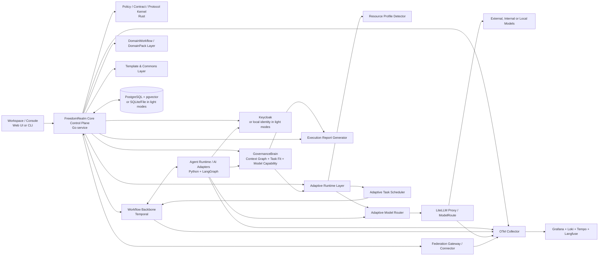

# 架构蓝图

## 总体形态

FreedomRealm 采用“FreedomRealm Core Control Plane + GovernanceBrain + Agent Runtime + Workflow Backbone + Adaptive Runtime Layer + Domain/Template/Federation 扩展层”的结构。

## 技术栈基线

基线验证时间：2026-05-17。

FreedomRealm 只维护一条分层技术栈基线。基线选择原则是：在保证生产稳定、依赖兼容、跨平台可用、可审计和可回滚的前提下，为每个架构层选择合适语言。`Current`、RC、beta、canary、preview-only 和 experimental-only 能力不得作为 Enterprise Mode 的强制依赖。ADR-0010 已将长期生产 Core Control Plane 的默认方向修正为 Go 服务主干，并将高治理契约收敛到 Rust Policy / Contract / Protocol Kernel；Node.js 继续用于 TypeScript 前端、Demo Mode、仓库脚本和轻量 glue code。

| 层 | 选型 | 用途 |
| --- | --- | --- |
| Web UI | Next.js 16.2, React 19, TypeScript 6.0, Tailwind CSS v4, shadcn/ui | 工作台、审计台、管理台、社区实例控制台 |
| CLI / Minimal UI | CLI-first，极简 Web UI 后续读取同一执行数据 | Tiny/Demo Mode 的最小体验、报告卡导出和后续展示 |
| 数据获取 | TanStack Query | 查询缓存、失效控制、后台刷新 |
| E2E | Playwright | 人机协作流、审批流、Demo Mode 回归 |
| 控制面 | Go，具体框架在 Phase 1 服务实现 ADR / execution plan 中确定 | HR 核心域、ProjectInstance、审批、任务、策略、审计 API、ReportCard 服务、Federation Gateway、本地单二进制服务 |
| Policy / Contract / Protocol Kernel | Rust | ToolContract 校验、PolicyRule 执行、DataClassification 继承、FederationMessage envelope、ExecutionReportCard schema、风险等级判定 |
| 数据访问与迁移 | 随 Go 控制面选型确定，必须类型安全、可审计、可回滚 | 模式定义、迁移、查询和事件 outbox |
| 主数据库 | PostgreSQL 18 | Enterprise/Community 事务数据、事件 outbox、检索元数据 |
| 轻量存储 | SQLite 或文件存储 | Tiny/Demo/Local Mode 的最小运行 |
| 向量能力 | pgvector，可降级关闭 | 知识检索、长期记忆、样本召回 |
| Agent Runtime / AI adapter | Python 3.14 stable, LangGraph, Pydantic v2，可按需要使用 FastAPI | graph 执行、tool-calling、HITL 中断、模型实验、evals、外部 agent adapter；不直接写核心事实 |
| Workflow | Temporal，可在轻量档位降级为本地状态机 | 长流程、补偿、超时、审批闸门、恢复 |
| 模型网关 | LiteLLM Proxy / ModelRoute | 统一模型协议、预算、策略、审计 |
| 治理型 AI 中枢 | GovernanceBrain | 项目上下文图谱、智能分派建议、模型能力治理、受控自我迭代候选 |
| 身份 | Keycloak，可在轻量档位降级为本地身份 | OIDC/SAML/LDAP/AD 和 Enterprise 身份治理 |
| 可观测性 | OTel Collector, Grafana, Loki, Tempo, Langfuse | 业务与 LLM 双重观测，可按档位降级 |

当前 Node.js 基线只约束 Web、Demo 和仓库脚本。Node.js 26 或后续版本只有在进入 LTS，并且 Next.js、Playwright、pnpm workspace 和项目 CI 全部通过后，才能替换前端与工具链基线。Node.js / NestJS 不再是长期生产 Core Control Plane 的默认方向；若未来重新采用，必须新增 ADR 说明原因、边界、风险、测试和回滚方式。

## 控制面模块

控制面采用模块化单体，长期生产实现默认采用 Go 服务主干，并调用 Rust Policy / Contract / Protocol Kernel 处理高治理契约。首期推荐模块如下：

- `org`：组织根、部门树、负责人、组织编码与目录视图。
- `workforce`：账号、员工档案、雇佣生命周期、考勤事实。
- `access`：角色、权限目录、授权关系、有效权限快照。
- `instances`：ProjectInstance、InstanceMember、CommunityActor、运行档位和实例配置。
- `work`：`WorkItem`、任务路由、SLA、协作状态。
- `community`：公告、帖子、评论、内容治理与知识索引引用。
- `approvals`：`ApprovalGate`、审批策略、审批记录。
- `agents`：`AgentActor` 注册、能力、版本、预算。
- `knowledge`：知识索引、记忆引用、资料治理、TeachingMaterial 和 LearningPath。
- `governance_brain`：项目上下文图谱、MemberCapabilityProfile、TaskFitAssessment、ModelCapabilityProfile、CapabilityDiscovery 候选和治理建议。
- `policy`：`PolicyRule`、风险分级、预算约束。
- `runtime`：ResourceProfile、AdaptiveRuntimePolicy、模型路由和任务调度策略。
- `templates`：Workflow Template、Skill Recipe、ToolContract、Eval sample、Failure case、Review note。
- `federation`：FederationPeer、FederationLink、CapabilityOffer、CapabilityRequest、SharedTemplate、SharedEvalSummary。
- `reports`：ExecutionReportCard 生成、脱敏状态、公开分享许可。
- `audit`：审计流、合规模型、追溯查询。

## 模块边界规则

- 模块之间通过应用服务、领域事件或显式 repository 接口协作，不直接跨模块修改内部表。
- `audit` 模块只追加审计事件，不参与业务事实的主事务决策。
- `policy` 模块输出策略判断，不能直接执行业务副作用。
- `agents` 模块登记身份、能力和预算，不承载 LangGraph graph 执行。
- `governance_brain` 模块生成项目理解、分派建议、模型能力建议和学习候选，不直接执行高风险副作用。
- `runtime` 模块可以降级运行策略，但不能放宽安全、审批、审计、预算和数据分级。
- `federation` 模块不能让远程实例直接修改本地事实，所有高风险动作必须回到本实例 ApprovalGate。
- `knowledge` 模块可以提供检索和摘要引用，但不能替代 `workforce`、`access` 或 `approvals` 中的事实。
- 所有模块的外部接口必须映射到 [api-contracts.md](api-contracts.md) 中的资源族或事件前缀。

## 运行面职责

Agent Runtime 不承担 HR 主数据真相，职责限制为：

- 读取控制面下发的任务、上下文与策略。
- 选择或编排 `Skill` 和 `ToolContract`。
- 在 LangGraph 中执行状态化 graph。
- 在触发人工介入时暂停并恢复。
- 将运行结果、`Observation` 和建议写回控制面。
- 支持 AdaptiveRuntimePolicy 下发的模型路由、并发限制、mock/stub 和人工接管。

运行面禁止：

- 直接修改 HR 主数据表。
- 自行决定审批是否可跳过。
- 直接访问公网模型。
- 持有跨环境共享的长期记忆或工具 token。
- 将 prompt、workflow 或策略候选直接写入生产配置。
- 代表远程 ProjectInstance 执行本地高风险工具。

## Temporal 与 LangGraph 的分工

- LangGraph：单次 AgentRun 内部的推理图、节点状态和中断恢复。
- Temporal：跨 run、跨系统、跨人机边界的业务工作流。

这意味着：

- “生成候选 offer 文案并等待主管审核”是 Temporal 工作流。
- “分析候选人资料并调用工具草拟文案”是 LangGraph graph。
- “跨实例请求一个公开能力并等待回调”由本地 Temporal 或等价工作流保持本地 owner。

轻量档位若暂不启用 Temporal，必须保留状态、审批、超时、失败和审计语义，不能把长流程变成不可恢复脚本。

## Adaptive Runtime Layer

Adaptive Runtime Layer 包含：

- `Resource Profile Detector`：记录 CPU、内存、GPU、磁盘、网络、本地模型、远程模型、预算、并发上限和隐私偏好。
- `Adaptive Model Router`：根据资源、成本、延迟、数据分级和模型可用性选择本地模型、远程模型、mock 模型或人工接管。
- `Adaptive Task Scheduler`：控制并发、批处理、暂停恢复、预算阻塞、任务拆分和人工确认。

约束：

- 高风险任务不因资源不足绕过 ApprovalGate。
- 高敏数据不因本地模型不可用自动发送到远程模型。
- 预算耗尽后阻塞、降级或请求人工确认。
- 降级决策必须进入审计或运行摘要。

## GovernanceBrain Layer

GovernanceBrain Layer 是 `ProjectInstance` 内的长期治理中枢，负责把项目知识、成员画像、任务状态、模型能力、评测结果和学习候选连接起来。

核心能力：

- 构建项目上下文图谱，保留来源、版本、可信度、数据分级和失效条件。
- 根据 `MemberCapabilityProfile`、任务风险、权限、负载和 SLA 生成 `TaskFitAssessment`。
- 根据 `ModelCapabilityProfile`、任务能力要求、预算、延迟和数据分级提出 `ModelRoute` 建议。
- 生成 `CapabilityDiscovery`、`LearningPath` 和 `CapabilityProof` 相关候选，但不能形成绩效、排名、处罚或强制分派结论。
- 汇总失败案例、人工修正和评测结果，生成受控自我迭代候选。
- 生成项目基线解释、冲突报告、review 建议和治理摘要。

架构约束：

- GovernanceBrain 只通过控制面读写事实、建议和候选，不直接修改 HR 主数据、权限、预算或生产策略。
- 分派建议不能替代人类 owner；高风险任务必须保留审批责任。
- 模型能力建议必须绑定评测结果和回退策略，不能仅凭模型名称或供应商决定。
- 记忆和上下文图谱不能跨环境共享，公开或跨实例共享只能使用 `SharedTemplate` 或 `SharedEvalSummary`。

## DomainWorkflow / DomainPack Layer

`DomainWorkflow` 是面向领域的可复用工作流。`DomainPack` 是围绕领域组织的一组模板、技能、工具契约、评测样本、失败案例和复盘说明。

首批方向包括：

- 招聘筛选。
- 入职流程。
- 政策问答。
- 考勤修正。
- GitHub issue 分流。
- 会议纪要整理。
- 文档摘要。
- 社区贡献者 onboarding。

DomainPack 不能绕过平台统一的 ToolContract、PolicyRule、ApprovalGate 和 EvalRun。

## Template & Commons Layer

Template & Commons Layer 管理：

- Workflow Template。
- Skill Recipe。
- ToolContract。
- Eval sample。
- Failure case。
- Review note。
- ExecutionReportCard 引用。

进入 Community Commons 的资产必须是用户明确发布的内容。用户私有数据、敏感数据、内部任务、非公开日志和原始模型上下文不得默认进入公共资产。

## Federation Gateway / Connector

Federation Gateway / Connector 支持：

- FederationPeer 注册和信任等级。
- FederationLink 授权、速率限制和撤销。
- CapabilityOffer 发布。
- CapabilityRequest 调用。
- SharedTemplate 交换。
- SharedEvalSummary 交换。
- FederationManifest 发现。
- FederationMessage 接收、幂等、schema 校验和回执。

架构约束：

- 跨实例通信默认拒绝。
- 跨实例通信必须显式授权。
- 跨实例消息必须审计。
- 跨实例互操作只能依赖 FederationProtocol 的稳定端点和 envelope，不依赖对方内部 API。
- 二次开发只能通过 CapabilityOffer、schema 和 namespaced extensions 扩展，不能改变标准 FederationMessage 字段语义。
- 高风险动作必须回到本实例 ApprovalGate。
- 敏感数据不得默认跨实例传输。
- 远程实例不能直接调用本地高风险工具。

## Execution Report Generator

Execution Report Generator 生成 `ExecutionReportCard`，用于传播、复盘和案例库。

`ExecutionReportCard` 的 canonical source 必须是结构化 JSON。Markdown、HTML、Web UI 卡片和公开案例页面只是渲染物。首版 CLI 可以默认导出 Markdown，但必须同时保存 JSON；后续 Web UI 必须读取同一 JSON，不能重新定义一套报告卡事实结构。

字段至少包括：

- 身份：`reportCardId`、`schemaVersion`、`generatedAt`。
- 任务引用：`projectInstanceId`、`workItemId`、`agentRunId`。
- 模板引用：`templateId`、`templateVersion`。
- 输入输出引用：`inputRefs`、`outputRefs`。
- 执行者：`agentActorId`、`humanOwnerId`。
- 工具：`skillRefs`、`toolContractRefs`。
- 治理：`riskLevel`、`approvalStatus`、`auditRefs`。
- 数据：`dataClassification`、`redactionStatus`、`sharePermission`。
- 结果：`status`、`summary`、`findings`、`recommendations`、`nextActions`。
- 扩展：`metrics`、`failure`、`extensions`。

公开分享必须显式授权，且不得泄漏私有数据、敏感字段、内部任务或原始模型上下文。

## 数据分层

- 事务层：组织、账号、员工档案、考勤、访问控制、ProjectInstance、协作内容、任务、审批、策略、审计。
- 事件层：组织事件、人员事件、考勤事件、授权事件、工作流事件、agent run 事件、评测事件、实例事件、跨实例事件、报告卡事件。
- 记忆层：知识块、嵌入、召回索引、长期记忆映射、协作内容摘要。
- 学习材料层：TeachingMaterial、LearningPath、TeachingStrategy、KeywordHelpOverlay 索引和文档示例；MVP 阶段以文档教材为主。
- 治理上下文层：项目上下文图谱、成员能力画像、任务适配评估、模型能力画像、冲突报告和治理建议。
- 模板层：Workflow Template、Skill Recipe、ToolContract、Eval sample、Failure case、Review note。
- 观测层：日志、指标、trace、prompt、tool 调用、判定结果、审批路径。
- 训练资源层：脱敏后的训练、评测和模型能力改进资源，必须保留来源、用途、审批、审计、保留期和撤回路径。

## 数据所有权

| 数据类别 | 主 owner | 写入入口 | 读取者 | 关键约束 |
| --- | --- | --- | --- | --- |
| 组织、账号、员工、考勤 | 控制面 `org` / `workforce` | v1 API、受控迁移 | UI、Agent Runtime 只读或受控工具 | 高敏字段按权限与数据分级过滤 |
| ProjectInstance 与成员 | 控制面 `instances` | API、管理操作 | UI、Agent Runtime 只读 | 成员权限、审批责任和可见范围必须审计 |
| 成员能力画像与任务适配 | 控制面 `governance_brain` / `instances` | 成员设置、Observation、review 结果、人工修正 | UI、GovernanceBrain、Work 路由 | 只能用于建议，不能扩大权限或替代审批责任 |
| 成员权利与贡献记录 | 控制面 `instances` / `community` / `governance_brain` | 成员自述、人工确认、贡献引用、review 结果 | UI、GovernanceBrain、社区治理 | AI 分派是建议，拒绝建议不得自动记为负面贡献 |
| WorkItem 与审批 | 控制面 `work` / `approvals` | API、Temporal workflow | UI、Temporal、Agent Runtime | 状态迁移必须审计 |
| 策略与预算 | 控制面 `policy` | 管理 API + ApprovalGate | Agent Runtime、LiteLLM Proxy | 生产变更强审批 |
| 自适应策略与模型能力画像 | 控制面 `runtime` / `governance_brain` | 配置、ResourceProfile、PolicyRule、EvalRun | Agent Runtime、Scheduler、Model Gateway | 降级不能绕过安全治理，模型路由必须绑定评测 |
| FederationLink | 控制面 `federation` | 显式授权 + ApprovalGate | Federation Connector、审计 | 默认不互信、可撤销、可审计 |
| 知识与记忆 | 控制面 `knowledge` | 文档导入、Observation、评测沉淀 | Agent Runtime、搜索接口 | 不是真实 HR 主数据 |
| 学习材料与能力证据 | 控制面 `knowledge` / `governance_brain` / `community` | 文档教材、模板说明、贡献引用、review、失败复盘 | UI、GovernanceBrain、成员本人、社区治理 | MVP 以文档教学为主，CapabilityProof 不能压缩成单一能力分 |
| 脱敏训练资源 | 控制面 `knowledge` / `runtime` / `governance_brain` | 脱敏 Observation、失败样本、人工修正、审批结果 | EvalRun、ModelCapabilityProfile、学习飞轮 | 原始敏感数据不得直接保留为训练资源 |
| 事件 outbox | 控制面各模块 | 业务事务内追加 | 消费者、审计、评测管道 | 至少一次投递，消费者幂等 |
| 观测数据 | OTel/Langfuse | 服务 SDK、网关、运行面 | 运维、治理者 | 必须带 env、actor、ProjectInstance 和版本标签 |

## 一致性与事件

- 核心 HR 事实使用数据库事务保证强一致。
- 跨模块副作用通过 outbox 事件驱动，消费者必须支持幂等。
- Temporal workflow id 必须能够关联 `WorkItem` 和业务实体。
- AgentRun 输出先作为候选或建议写回，只有通过策略和审批后才能触发高风险副作用。
- Federation 消息消费者失败不能伪造成功，必须进入重试、死信或人工处理队列。
- 事件消费者失败不能阻塞主事务，但必须进入重试、死信或人工处理队列。

## Demo Mode 最小路径

Demo Mode 必须能在不启动 Keycloak、Temporal、PostgreSQL、完整 OTel、Langfuse 或 Grafana 的情况下展示核心治理语义，避免首次体验被企业级依赖阻塞。

Demo Mode 必须配套 document-first 的 TeachingMaterial。新用户应能按文档在 5 到 10 分钟内跑通首个模板；KeywordHelpOverlay、自适应教学和复杂 CapabilityDiscovery 不得成为前置条件。

首版入口采用 CLI-first。极简 Web UI 在 CLI 闭环稳定后读取同一份执行数据和 `ExecutionReportCard`，用于展示工作台、审批台、报告卡和文档教学入口；Web UI 不应重新实现独立业务逻辑。

1. 用户在 CLI 中创建合成或本地文档驱动的 `WorkItem`。
2. 本地身份和本地策略检查生成初始风险等级。
3. GovernanceBrain 使用内置样例生成 `TaskFitAssessment` 和模型能力建议。
4. Adaptive Runtime 默认选择 mock model；用户自带模型 API key 或本地模型只作为可选 live model 增强路径。
5. 本地状态机模拟 Temporal 的关键语义：暂停、恢复、失败、审批等待和回滚记录。
6. Agent Runtime 使用 mock/stub `ToolContract` 执行低风险任务，高风险动作仍进入 `ApprovalGate`。
7. Control Plane 写入本地事实、审计摘要和 Observation。
8. Execution Report Generator 生成 JSON 形式的 `ExecutionReportCard` 并默认渲染 Markdown，学习候选仅进入本地候选区，不自动改变策略。

Demo Mode 的目标是验证概念和边界，而不是绕过边界。任何在 Demo Mode 中被 mock 的能力，都必须保留与完整模式一致的接口语义、审计字段和失败状态。

mock model 输出必须固定、稳定、可测试，并标记模型路由为 mock。live model 不能成为 Demo Mode 跑通前置条件；它只能增强分析质量，不能改变 schema、审批、审计、数据分级或报告卡结构。

## Enterprise Mode 完整路径

Enterprise Mode 必须启用完整治理链路，适用于企业、强合规组织和需要跨实例协作的社区实例。

1. 用户或系统通过 OIDC/SAML/LDAP/AD 身份进入 Workspace。
2. Control Plane 使用 PostgreSQL 事务校验 `ProjectInstance`、权限、数据分级、预算和风险等级。
3. GovernanceBrain 读取受控上下文图谱，生成可解释 `TaskFitAssessment` 与 `ModelCapabilityProfile` 建议。
4. Adaptive Runtime 将建议转换为受策略约束的 `ModelRoute`、并发限制和降级策略。
5. Temporal 负责长流程状态、重试、超时、补偿和人工恢复。
6. Agent Runtime 在 LangGraph 内执行单次 run 的状态化推理，并通过 LiteLLM Proxy 或受控 ModelRoute 调用模型。
7. 高风险动作、生产发布、跨环境访问和高权限 `FederationLink` 变更必须进入 `ApprovalGate`。
8. OTel、Loki、Tempo、Grafana、Langfuse 和审计模块记录业务、模型、工具和审批链路。
9. Execution Report Generator 生成脱敏报告卡；公开分享必须显式授权。
10. 学习管道只在评测、审批、灰度和回滚路径齐备后更新模板、策略或模型路由。

## 典型请求路径

1. HumanActor 在 Workspace 创建 `WorkItem`。
2. Control Plane 校验权限、数据边界、ProjectInstance 和初始风险等级。
3. GovernanceBrain 可生成 `TaskFitAssessment`，解释候选执行者、人类 owner、模型能力要求和风险边界。
4. Adaptive Runtime 根据 ResourceProfile、ModelCapabilityProfile 和策略选择运行档位、模型路由和并发。
5. Temporal 创建或推进业务工作流。
6. Agent Runtime 在授权边界内执行 graph，并通过 LiteLLM Proxy 或受控 ModelRoute 调用模型。
7. 高风险动作请求进入 `ApprovalGate`。
8. 审批结果驱动 Temporal 继续、回退、补偿或关闭。
9. Control Plane 写入事实、事件、审计与 Observation。
10. Execution Report Generator 生成报告卡。
11. 学习管道和 GovernanceBrain 只消费 Observation、脱敏样本和评测结果，不直接改生产行为。

## 网络与安全边界

- Enterprise Mode 中控制面与运行面默认部署在企业内网。
- 只有 LiteLLM Proxy 所在的受控网段允许按策略出网。
- 外部模型调用必须走网关，不允许运行面直连公网模型。
- 身份、预算、审批、审计不得由模型输出自行决定。
- GovernanceBrain、ModelRoute 或模型输出不得自行决定成员权限、审批责任、风险等级或生产发布。
- 跨实例连接必须经过 FederationLink 授权，默认拒绝。
- 环境隔离边界以 [environment-isolation.md](environment-isolation.md) 为准。

## 明确反边界

以下能力不是当前架构目标，除非先经过 ADR、接口契约、评测基线和治理门禁更新：

- 不建设绕过人类 owner 的完全无人自治组织。
- 不让 GovernanceBrain 成为可直接执行高风险动作的超级 agent。
- 不让轻量档位弱化审批、安全、审计、预算或数据分级。
- 不让 Agent Runtime 直接写 HR 主事实、权限、预算、生产策略或环境配置。
- 不让模型输出自行决定权限、审批责任、风险等级、发布范围或跨实例信任。
- 不要求 Demo Mode 启动完整企业栈，也不允许 Enterprise Mode 以 Demo 语义规避治理。
- 不让跨实例协作依赖对方内部 API；只能使用 FederationProtocol、公开 schema 和 namespaced extensions。
- 不因本地资源不足而自动把高敏数据发送给远程模型。
- 不把社区共享默认视为公开；`SharedTemplate` 和 `SharedEvalSummary` 必须脱敏并显式授权。

## 可靠性设计

- 控制面 API 必须对写操作提供幂等键或业务唯一约束。
- Temporal 承担长流程重试、超时、补偿和人工恢复。
- Agent Runtime 失败时必须返回可审计失败状态，不得静默吞错。
- 模型网关失败时按策略切换备用路由、降级为人工接管或阻塞等待。
- FederationPeer 不可用时，本地 WorkItem 标记为 blocked、转人工或选择其他 peer。
- 数据库迁移、策略发布、模型路由变更和 FederationLink 高权限变更都必须有回滚路径。

## 运行档位

| 档位 | 面向对象 | 最小依赖 | 不启用的内容 |
| --- | --- | --- | --- |
| Tiny Mode | 低配设备、教学、轻量试用 | 文件存储或 SQLite、mock model、CLI 或极简 UI | 完整身份系统、完整观测栈、完整工作流引擎 |
| Demo Mode | 首次体验 | SQLite、mock 工具、用户自带模型 API key、ExecutionReportCard | Keycloak、Temporal、完整 OTel、Langfuse、Grafana |
| Local Mode | 个人长期使用 | 本地数据库、可选 Docker Compose、基础权限、基础审计 | 强企业治理栈可选 |
| Community Mode | 多人实例 | 多用户、角色权限、审批流、审计查询、模板共享 | 企业级合规能力可选 |
| Enterprise Mode | 企业和强治理组织 | Keycloak、Temporal、PostgreSQL、LiteLLM Proxy、OTel、Grafana/Loki/Tempo/Langfuse | 不允许绕过环境隔离和完整审计 |

## OpenAI 适配原则

若环境启用 OpenAI，推荐优先采用：

- Responses API 作为新项目主接口。
- Structured Outputs 作为边界结构化输出能力。
- Function Calling 作为工具调用能力。
- Evals 作为提示词与 agent 流程评测能力。

但这些只在 LiteLLM/OpenAI 适配层体现，系统整体不绑定单一厂商。
