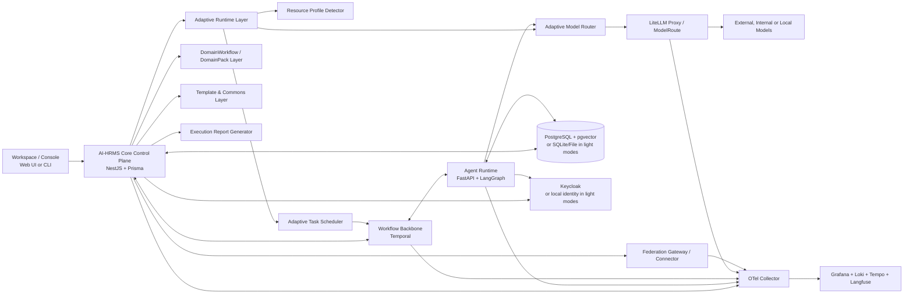

# 架构蓝图

## 总体形态

AI-HRMS 采用“AI-HRMS Core Control Plane + Agent Runtime + Workflow Backbone + Adaptive Runtime Layer + Domain/Template/Federation 扩展层”的结构。

## 技术栈基线

基线验证时间：2026-04-29。

| 层 | 选型 | 用途 |
| --- | --- | --- |
| Web UI | Next.js 15, React 19, TypeScript, Tailwind CSS v4, shadcn/ui | 工作台、审计台、管理台、社区实例控制台 |
| CLI / Minimal UI | 后续实现阶段定义 | Tiny/Demo Mode 的最小体验 |
| 数据获取 | TanStack Query | 查询缓存、失效控制、后台刷新 |
| E2E | Playwright | 人机协作流、审批流、Demo Mode 回归 |
| 控制面 | Node.js 24 LTS, NestJS | HR 核心域、ProjectInstance、审批、任务、策略、审计 API |
| ORM | Prisma ORM | 模式定义、迁移、类型安全查询 |
| 主数据库 | PostgreSQL 18 | Enterprise/Community 事务数据、事件 outbox、检索元数据 |
| 轻量存储 | SQLite 或文件存储 | Tiny/Demo/Local Mode 的最小运行 |
| 向量能力 | pgvector，可降级关闭 | 知识检索、长期记忆、样本召回 |
| Agent Runtime | Python 3.12, FastAPI, LangGraph, Pydantic v2 | graph 执行、tool-calling、HITL 中断 |
| Workflow | Temporal，可在轻量档位降级为本地状态机 | 长流程、补偿、超时、审批闸门、恢复 |
| 模型网关 | LiteLLM Proxy / ModelRoute | 统一模型协议、预算、策略、审计 |
| 身份 | Keycloak，可在轻量档位降级为本地身份 | OIDC/SAML/LDAP/AD 和 Enterprise 身份治理 |
| 可观测性 | OTel Collector, Grafana, Loki, Tempo, Langfuse | 业务与 LLM 双重观测，可按档位降级 |

## 控制面模块

控制面采用模块化单体，首期推荐模块如下：

- `org`：组织根、部门树、负责人、组织编码与目录视图。
- `workforce`：账号、员工档案、雇佣生命周期、考勤事实。
- `access`：角色、权限目录、授权关系、有效权限快照。
- `instances`：ProjectInstance、InstanceMember、CommunityActor、运行档位和实例配置。
- `work`：`WorkItem`、任务路由、SLA、协作状态。
- `community`：公告、帖子、评论、内容治理与知识索引引用。
- `approvals`：`ApprovalGate`、审批策略、审批记录。
- `agents`：`AgentActor` 注册、能力、版本、预算。
- `knowledge`：知识索引、记忆引用、资料治理。
- `policy`：`PolicyRule`、风险分级、预算约束。
- `runtime`：ResourceProfile、AdaptiveRuntimePolicy、模型路由和任务调度策略。
- `templates`：Workflow Template、Skill Recipe、ToolContract、Eval sample、Failure case、Review note。
- `federation`：FederationPeer、FederationLink、CapabilityOffer、CapabilityRequest、SharedTemplate、SharedEvalSummary。
- `reports`：ExecutionReportCard 生成、脱敏状态、公开分享许可。
- `audit`：审计流、合规模型、追溯查询。

## 模块边界规则

- 模块之间通过应用服务、领域事件或显式 repository 接口协作，不直接跨模块修改内部表。
- `audit` 模块只追加审计事件，不参与业务事实的主事务决策。
- `policy` 模块输出策略判断，不能直接执行业务副作用。
- `agents` 模块登记身份、能力和预算，不承载 LangGraph graph 执行。
- `runtime` 模块可以降级运行策略，但不能放宽安全、审批、审计、预算和数据分级。
- `federation` 模块不能让远程实例直接修改本地事实，所有高风险动作必须回到本实例 ApprovalGate。
- `knowledge` 模块可以提供检索和摘要引用，但不能替代 `workforce`、`access` 或 `approvals` 中的事实。
- 所有模块的外部接口必须映射到 [api-contracts.md](api-contracts.md) 中的资源族或事件前缀。

## 运行面职责

Agent Runtime 不承担 HR 主数据真相，职责限制为：

- 读取控制面下发的任务、上下文与策略。
- 选择或编排 `Skill` 和 `ToolContract`。
- 在 LangGraph 中执行状态化 graph。
- 在触发人工介入时暂停并恢复。
- 将运行结果、`Observation` 和建议写回控制面。
- 支持 AdaptiveRuntimePolicy 下发的模型路由、并发限制、mock/stub 和人工接管。

运行面禁止：

- 直接修改 HR 主数据表。
- 自行决定审批是否可跳过。
- 直接访问公网模型。
- 持有跨环境共享的长期记忆或工具 token。
- 将 prompt、workflow 或策略候选直接写入生产配置。
- 代表远程 ProjectInstance 执行本地高风险工具。

## Temporal 与 LangGraph 的分工

- LangGraph：单次 AgentRun 内部的推理图、节点状态和中断恢复。
- Temporal：跨 run、跨系统、跨人机边界的业务工作流。

这意味着：

- “生成候选 offer 文案并等待主管审核”是 Temporal 工作流。
- “分析候选人资料并调用工具草拟文案”是 LangGraph graph。
- “跨实例请求一个公开能力并等待回调”由本地 Temporal 或等价工作流保持本地 owner。

轻量档位若暂不启用 Temporal，必须保留状态、审批、超时、失败和审计语义，不能把长流程变成不可恢复脚本。

## Adaptive Runtime Layer

Adaptive Runtime Layer 包含：

- `Resource Profile Detector`：记录 CPU、内存、GPU、磁盘、网络、本地模型、远程模型、预算、并发上限和隐私偏好。
- `Adaptive Model Router`：根据资源、成本、延迟、数据分级和模型可用性选择本地模型、远程模型、mock 模型或人工接管。
- `Adaptive Task Scheduler`：控制并发、批处理、暂停恢复、预算阻塞、任务拆分和人工确认。

约束：

- 高风险任务不因资源不足绕过 ApprovalGate。
- 高敏数据不因本地模型不可用自动发送到远程模型。
- 预算耗尽后阻塞、降级或请求人工确认。
- 降级决策必须进入审计或运行摘要。

## DomainWorkflow / DomainPack Layer

`DomainWorkflow` 是面向领域的可复用工作流。`DomainPack` 是围绕领域组织的一组模板、技能、工具契约、评测样本、失败案例和复盘说明。

首批方向包括：

- 招聘筛选。
- 入职流程。
- 政策问答。
- 考勤修正。
- GitHub issue 分流。
- 会议纪要整理。
- 文档摘要。
- 社区贡献者 onboarding。

DomainPack 不能绕过平台统一的 ToolContract、PolicyRule、ApprovalGate 和 EvalRun。

## Template & Commons Layer

Template & Commons Layer 管理：

- Workflow Template。
- Skill Recipe。
- ToolContract。
- Eval sample。
- Failure case。
- Review note。
- ExecutionReportCard 引用。

进入 Community Commons 的资产必须是用户明确发布的内容。用户私有数据、敏感数据、内部任务、非公开日志和原始模型上下文不得默认进入公共资产。

## Federation Gateway / Connector

Federation Gateway / Connector 支持：

- FederationPeer 注册和信任等级。
- FederationLink 授权、速率限制和撤销。
- CapabilityOffer 发布。
- CapabilityRequest 调用。
- SharedTemplate 交换。
- SharedEvalSummary 交换。

架构约束：

- 跨实例通信默认拒绝。
- 跨实例通信必须显式授权。
- 跨实例消息必须审计。
- 高风险动作必须回到本实例 ApprovalGate。
- 敏感数据不得默认跨实例传输。
- 远程实例不能直接调用本地高风险工具。

## Execution Report Generator

Execution Report Generator 生成 `ExecutionReportCard`，用于传播、复盘和案例库。

字段至少包括：

- 任务目标。
- 发起者。
- 执行者。
- 使用的 Skill。
- 调用的 ToolContract。
- 风险等级。
- 审批结果。
- 成本。
- 延迟。
- 节省时间估算。
- 失败与人工修正。
- 可复用模板引用。
- 脱敏状态。
- 公开分享许可。

公开分享必须显式授权，且不得泄漏私有数据、敏感字段、内部任务或原始模型上下文。

## 数据分层

- 事务层：组织、账号、员工档案、考勤、访问控制、ProjectInstance、协作内容、任务、审批、策略、审计。
- 事件层：组织事件、人员事件、考勤事件、授权事件、工作流事件、agent run 事件、评测事件、实例事件、跨实例事件、报告卡事件。
- 记忆层：知识块、嵌入、召回索引、长期记忆映射、协作内容摘要。
- 模板层：Workflow Template、Skill Recipe、ToolContract、Eval sample、Failure case、Review note。
- 观测层：日志、指标、trace、prompt、tool 调用、判定结果、审批路径。

## 数据所有权

| 数据类别 | 主 owner | 写入入口 | 读取者 | 关键约束 |
| --- | --- | --- | --- | --- |
| 组织、账号、员工、考勤 | 控制面 `org` / `workforce` | v1 API、受控迁移 | UI、Agent Runtime 只读或受控工具 | 高敏字段按权限与数据分级过滤 |
| ProjectInstance 与成员 | 控制面 `instances` | API、管理操作 | UI、Agent Runtime 只读 | 成员权限、审批责任和可见范围必须审计 |
| WorkItem 与审批 | 控制面 `work` / `approvals` | API、Temporal workflow | UI、Temporal、Agent Runtime | 状态迁移必须审计 |
| 策略与预算 | 控制面 `policy` | 管理 API + ApprovalGate | Agent Runtime、LiteLLM Proxy | 生产变更强审批 |
| 自适应策略 | 控制面 `runtime` | 配置、ResourceProfile、PolicyRule | Agent Runtime、Scheduler | 降级不能绕过安全治理 |
| FederationLink | 控制面 `federation` | 显式授权 + ApprovalGate | Federation Connector、审计 | 默认不互信、可撤销、可审计 |
| 知识与记忆 | 控制面 `knowledge` | 文档导入、Observation、评测沉淀 | Agent Runtime、搜索接口 | 不是真实 HR 主数据 |
| 事件 outbox | 控制面各模块 | 业务事务内追加 | 消费者、审计、评测管道 | 至少一次投递，消费者幂等 |
| 观测数据 | OTel/Langfuse | 服务 SDK、网关、运行面 | 运维、治理者 | 必须带 env、actor、ProjectInstance 和版本标签 |

## 一致性与事件

- 核心 HR 事实使用数据库事务保证强一致。
- 跨模块副作用通过 outbox 事件驱动，消费者必须支持幂等。
- Temporal workflow id 必须能够关联 `WorkItem` 和业务实体。
- AgentRun 输出先作为候选或建议写回，只有通过策略和审批后才能触发高风险副作用。
- Federation 消息消费者失败不能伪造成功，必须进入重试、死信或人工处理队列。
- 事件消费者失败不能阻塞主事务，但必须进入重试、死信或人工处理队列。

## 典型请求路径

1. HumanActor 在 Workspace 创建 `WorkItem`。
2. Control Plane 校验权限、数据边界、ProjectInstance 和初始风险等级。
3. Adaptive Runtime 根据 ResourceProfile 和策略选择运行档位、模型路由和并发。
4. Temporal 创建或推进业务工作流。
5. Agent Runtime 在授权边界内执行 graph，并通过 LiteLLM Proxy 或受控 ModelRoute 调用模型。
6. 高风险动作请求进入 `ApprovalGate`。
7. 审批结果驱动 Temporal 继续、回退、补偿或关闭。
8. Control Plane 写入事实、事件、审计与 Observation。
9. Execution Report Generator 生成报告卡。
10. 学习管道只消费 Observation 和脱敏样本，不直接改生产行为。

## 网络与安全边界

- Enterprise Mode 中控制面与运行面默认部署在企业内网。
- 只有 LiteLLM Proxy 所在的受控网段允许按策略出网。
- 外部模型调用必须走网关，不允许运行面直连公网模型。
- 身份、预算、审批、审计不得由模型输出自行决定。
- 跨实例连接必须经过 FederationLink 授权，默认拒绝。
- 环境隔离边界以 [environment-isolation.md](environment-isolation.md) 为准。

## 可靠性设计

- 控制面 API 必须对写操作提供幂等键或业务唯一约束。
- Temporal 承担长流程重试、超时、补偿和人工恢复。
- Agent Runtime 失败时必须返回可审计失败状态，不得静默吞错。
- 模型网关失败时按策略切换备用路由、降级为人工接管或阻塞等待。
- FederationPeer 不可用时，本地 WorkItem 标记为 blocked、转人工或选择其他 peer。
- 数据库迁移、策略发布、模型路由变更和 FederationLink 高权限变更都必须有回滚路径。

## 运行档位

| 档位 | 面向对象 | 最小依赖 | 不启用的内容 |
| --- | --- | --- | --- |
| Tiny Mode | 低配设备、教学、轻量试用 | 文件存储或 SQLite、mock model、CLI 或极简 UI | 完整身份系统、完整观测栈、完整工作流引擎 |
| Demo Mode | 首次体验 | SQLite、mock 工具、用户自带模型 API key、ExecutionReportCard | Keycloak、Temporal、完整 OTel、Langfuse、Grafana |
| Local Mode | 个人长期使用 | 本地数据库、可选 Docker Compose、基础权限、基础审计 | 强企业治理栈可选 |
| Community Mode | 多人实例 | 多用户、角色权限、审批流、审计查询、模板共享 | 企业级合规能力可选 |
| Enterprise Mode | 企业和强治理组织 | Keycloak、Temporal、PostgreSQL、LiteLLM Proxy、OTel、Grafana/Loki/Tempo/Langfuse | 不允许绕过环境隔离和完整审计 |

## OpenAI 适配原则

若环境启用 OpenAI，推荐优先采用：

- Responses API 作为新项目主接口。
- Structured Outputs 作为边界结构化输出能力。
- Function Calling 作为工具调用能力。
- Evals 作为提示词与 agent 流程评测能力。

但这些只在 LiteLLM/OpenAI 适配层体现，系统整体不绑定单一厂商。
