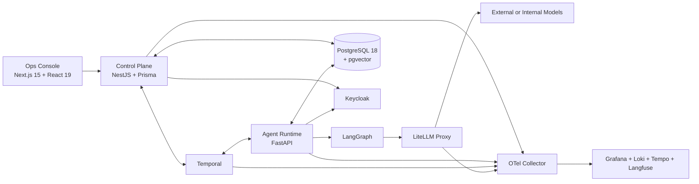

# 架构蓝图

## 总体形态

AI HRMS 采用“模块化单体控制面 + 独立智能体运行面 + Durable Workflow 骨干”的结构。

## 技术栈基线

基线验证时间：2026-04-29。

| 层 | 选型 | 用途 |
| --- | --- | --- |
| Web UI | Next.js 15, React 19, TypeScript, Tailwind CSS v4, shadcn/ui | 运营台、工作台、审计台、管理台 |
| 数据获取 | TanStack Query | 查询缓存、失效控制、后台刷新 |
| E2E | Playwright | 人机协作流和审批流回归 |
| 控制面 | Node.js 24 LTS, NestJS | HR 核心域、审批、任务、策略、审计 API |
| ORM | Prisma ORM | 模式定义、迁移、类型安全查询 |
| 主数据库 | PostgreSQL 18 | 事务数据、事件 outbox、检索元数据 |
| 向量能力 | pgvector | 知识检索、长期记忆、样本召回 |
| Agent Runtime | Python 3.12, FastAPI, LangGraph, Pydantic v2 | graph 执行、tool-calling、HITL 中断 |
| Workflow | Temporal | 长流程、补偿、超时、审批闸门、恢复 |
| 模型网关 | LiteLLM Proxy | 统一模型协议、预算、策略、审计 |
| 身份 | Keycloak | OIDC/SAML/LDAP/AD |
| 可观测性 | OTel Collector, Grafana, Loki, Tempo, Langfuse | 业务与 LLM 双重观测 |

## 控制面模块

控制面采用模块化单体，首期推荐模块如下：

- `org`：组织根、部门树、负责人、组织编码与目录视图
- `workforce`：账号、员工档案、雇佣生命周期、考勤事实
- `access`：角色、权限目录、授权关系、有效权限快照
- `work`：`WorkItem`、任务路由、SLA、协作状态
- `community`：公告、帖子、评论、内容治理与知识索引引用
- `approvals`：`ApprovalGate`、审批策略、审批记录
- `agents`：`AgentActor` 注册、能力、版本、预算
- `knowledge`：知识索引、记忆引用、资料治理
- `policy`：`PolicyRule`、风险分级、预算约束
- `audit`：审计流、合规模型、追溯查询

## 运行面职责

Agent Runtime 不承担企业主数据真相，职责限制为：

- 读取控制面下发的任务、上下文与策略
- 选择或编排 `Skill` 和 `ToolContract`
- 在 LangGraph 中执行状态化 graph
- 在触发人工介入时暂停并恢复
- 将运行结果、`Observation` 和建议写回控制面

## Temporal 与 LangGraph 的分工

- LangGraph：单次 agent run 内部的推理图、节点状态和中断恢复
- Temporal：跨 run、跨系统、跨人机边界的业务工作流

这意味着：

- “生成候选 offer 文案并等待主管审核”是 Temporal 工作流
- “分析候选人资料并调用工具草拟文案”是 LangGraph graph

## 数据分层

- 事务层：组织、账号、员工档案、考勤、访问控制、协作内容、任务、审批、策略、审计
- 事件层：组织事件、人员事件、考勤事件、授权事件、工作流事件、agent run 事件、评测事件
- 记忆层：知识块、嵌入、召回索引、长期记忆映射、协作内容摘要
- 观测层：日志、指标、trace、prompt、tool 调用、判定结果、审批路径

## 网络与安全边界

- 控制面与运行面默认部署在企业内网
- 只有 LiteLLM Proxy 所在的受控网段允许按策略出网
- 外部模型调用必须走网关，不允许运行面直连公网模型
- 身份、预算、审批、审计不得由模型输出自行决定

## OpenAI 适配原则

若环境启用 OpenAI，推荐优先采用：

- Responses API 作为新项目主接口
- Structured Outputs 作为边界结构化输出能力
- Function Calling 作为工具调用能力
- Evals 作为提示词与 agent 流程评测能力

但这些只在 LiteLLM/OpenAI 适配层体现，系统整体不绑定单一厂商。
