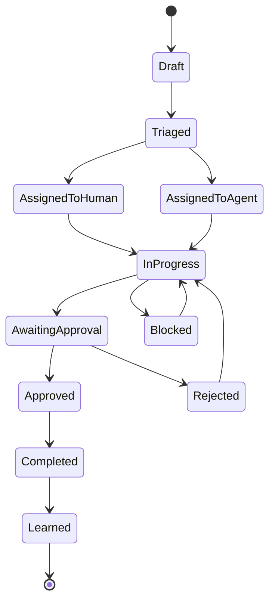
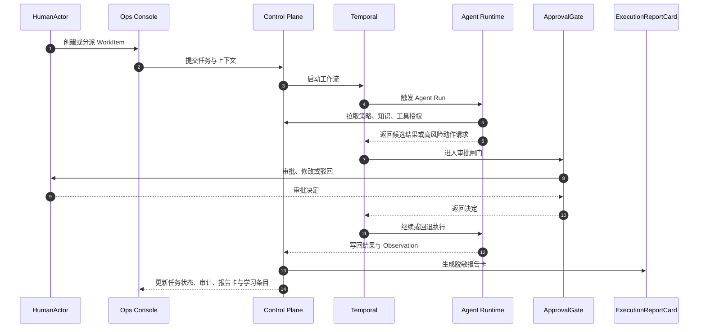

# 人机协作流程

## 设计目标

系统中的每一项工作都必须能回答四个问题：

1. 谁提出目标？
2. 谁实际执行？
3. 谁承担审批责任？
4. 从执行结果中学到了什么？

在 AI 时代 HRMS 中，还必须能回答：

5. 该工作属于哪个 `ProjectInstance`？
6. 是否触发跨实例协作？
7. 是否生成可复用模板、失败样本或 `ExecutionReportCard`？
8. GovernanceBrain 是否给出了可追溯的分派建议、模型能力要求和人类 owner？

## 人机分工

AI 适合承担样板代码、文档草稿、API schema、`ToolContract`、测试、质量门禁检查、一致性检查、日志摘要、失败复盘草稿、模板生成、重复性维护工作、运行报告生成和低风险任务执行。

人类适合承担愿景取舍、价值判断、真实用户需求判断、高风险审批、安全与伦理边界、社区治理、冲突处理、许可证和商标决策、最终责任承担，以及判断哪些工作应交给 AI。

原则：

- 人类可以退出重复执行。
- 人类保留目标、边界、责任和高风险判断。
- AI 执行必须受策略、预算、权限、审批、审计和回滚约束。
- GovernanceBrain 可以建议分派和协调协作，但高风险任务必须保留人类 owner 和 ApprovalGate。
- AI 分派默认是建议，不是命令；成员可以拒绝、延后、协商、缩小范围或转交建议分派，拒绝建议本身不得自动成为负面贡献记录。

## 最小可传播闭环

Demo Mode 的最小闭环：

1. 创建 `WorkItem`。
2. 分派给 `AgentActor`。
3. `AgentActor` 调用 `ToolContract`。
4. 命中高风险动作后进入 `ApprovalGate`。
5. `HumanActor` 批准、拒绝或修改。
6. 生成 `Observation`。
7. 形成 `LearningArtifact` 或 `Eval sample`。
8. 导出 `ExecutionReportCard`。

该闭环可以使用 mock model、mock 工具、SQLite 或手动执行模式，但不能跳过审批、审计、预算和数据分级语义。

## WorkItem 生命周期

## 状态迁移规则

| 迁移 | 触发者 | 必要检查 |
| --- | --- | --- |
| `Draft -> Triaged` | HumanActor 或分流策略 | 目标、请求方、风险等级、业务上下文完整 |
| `Triaged -> AssignedToHuman` | 任务路由 | 目标人类具备权限和可用性 |
| `Triaged -> AssignedToAgent` | 任务路由 | AgentActor 具备能力、预算、工具授权和模型路由；若采用 GovernanceBrain 建议，必须保留 TaskFitAssessment 引用 |
| `AssignedToAgent -> InProgress` | Temporal | 已创建 AgentRun，绑定策略版本和 checkpoint |
| `InProgress -> AwaitingApproval` | PolicyRule | 命中高风险动作或敏感数据边界 |
| `AwaitingApproval -> Approved` | ApprovalGate | 审批人具备权限，记录审批理由和输入输出引用 |
| `AwaitingApproval -> Rejected` | ApprovalGate | 记录拒绝原因，回到执行态或关闭 |
| `InProgress -> Blocked` | 执行者或系统 | 记录阻塞原因、owner 和下一次检查时间 |
| `Completed -> Learned` | 学习管道 | Observation 已采集，敏感数据已处理 |

任何状态迁移都必须追加审计事件，且不能删除历史状态。

涉及成员画像、贡献记录和拒绝权的协作规则见 [member-rights-and-contribution.md](member-rights-and-contribution.md)。

## 标准协作流

## 典型场景

### 场景 1：智能体辅助招聘筛选

- 人类定义岗位要求和筛选阈值
- AgentActor 对候选人包进行摘要、排序、风险标注
- 高风险判断或拒绝建议必须通过 `ApprovalGate`
- 最终决策与理由被沉淀为 `LearningArtifact`

### 场景 2：入职流程编排

- Temporal 编排跨系统流程
- AgentActor 生成个性化入职包、FAQ 和日程建议
- 人类 HR 审核关键信息后触发发送
- 失败节点走补偿流程并记录审计轨迹

### 场景 3：政策问答与流程建议

- HumanActor 发起问题
- AgentActor 检索知识库并生成结构化答案
- 若触及薪酬、合规、雇佣风险等高风险领域，输出仅作为建议
- 若用户要求执行变更，则必须转入 `WorkItem + ApprovalGate`

### 场景 4：考勤补签与人工修正

- HumanActor 发起补签或修正请求，系统创建 WorkItem。
- Control Plane 校验员工、部门、日期和当前考勤状态。
- PolicyRule 根据修正类型、时间跨度和操作者权限判断风险。
- 低风险更正可进入主管审批，高风险批量修正必须升级到 HR 管理员或合规角色。
- ApprovalGate 决策后由控制面写入考勤事实，AgentActor 只能生成说明、收集证据或草拟通知。
- 修正前后值、审批理由和附件引用必须写入审计。

### 场景 5：生产策略候选发布

- AgentActor 或 HumanActor 提出 prompt、workflow、策略或模型路由候选。
- 系统创建 Experiment，绑定数据集、指标、风险等级和退出条件。
- `staging` 完成沙盒评测和流程回放。
- 人类审批差异报告后，才能在 `prod` 进入灰度发布。
- 观察窗口内若出现治理指标劣化、成本异常或审批漏触发，必须停止扩大并回滚。

### 场景 6：开源项目 issue 分流

- CommunityActor 在社区实例中导入或创建 issue 类 WorkItem。
- AgentActor 使用 issue 分流模板提取主题、风险、复现信息和候选标签。
- 低风险标签建议可自动生成，关闭 issue、@外部用户或修改权限相关内容必须进入 ApprovalGate。
- 处理结果生成 ExecutionReportCard，可在脱敏并授权后公开分享。
- 失败样本和人工修正进入 Eval sample 或 Failure case。

### 场景 7：跨实例模板共享

- 一个 ProjectInstance 通过 FederationLink 向 FederationPeer 请求 SharedTemplate。
- 本地控制面检查信任等级、数据共享等级、速率限制和审计要求。
- 模板进入本地实例后必须重新绑定本地 ToolContract、PolicyRule 和 ApprovalGate。
- 远程模板不能携带本地敏感数据，也不能直接获得本地高风险工具权限。

### 场景 8：GovernanceBrain 协调多人开发

- HumanActor 提出一个跨文档、接口和实现的目标。
- GovernanceBrain 读取项目上下文图谱，生成当前基线解释、影响范围和 `TaskFitAssessment`。
- 系统根据成员技能、兴趣、负载、权限、数据可见范围、学习目标和可承担风险等级建议 human owner、reviewer、AgentActor contributor 和候选模型路由。
- 人类确认或修改分派后，Temporal 创建或推进对应 WorkItem。
- AgentActor 可以并行产出草稿、测试、文档或迁移 PR，但高风险变更仍进入 ApprovalGate。
- 分派接受、人工改派、模型失败、review 结果和阻塞原因进入 Observation，供后续评测和学习飞轮使用。

## 人工中断点

以下场景默认要求人工中断：

- 访问高敏数据
- 发起外部沟通
- 变更组织/雇佣/薪酬事实
- 修改审批策略、预算或模型路由
- 影响生产策略或发布状态的学习结果落地

## 失败与补偿

- AgentRun 失败：Temporal 保留流程状态，WorkItem 标记为 `blocked` 或转人工处理。
- 工具调用失败：记录工具、输入引用、错误码和重试策略；高风险工具不能自动无限重试。
- 审批超时：按 ApprovalGate 策略提醒、升级或取消，不能默认批准。
- 外部通知发送失败：进入补偿分支，记录是否已部分送达。
- 数据写入失败：主事务回滚，outbox 事件不得伪造成功。
- 模型不可用：使用备用模型路由、降级到只读建议或请求人工接管。

## 学习沉淀规则

- 只沉淀完成、失败、驳回、升级和人工修正样本，不只采集成功样本。
- LearningArtifact 必须带来源 WorkItem、数据分级、适用范围和环境标签。
- 含敏感字段的样本进入评测前必须脱敏或摘要化。
- 学习沉淀不能改变生产策略，只能进入 [learning-flywheel.md](learning-flywheel.md) 定义的受控飞轮。
- GovernanceBrain 生成的分派策略、模型路由或上下文图谱修正也只能作为候选进入受控飞轮。
