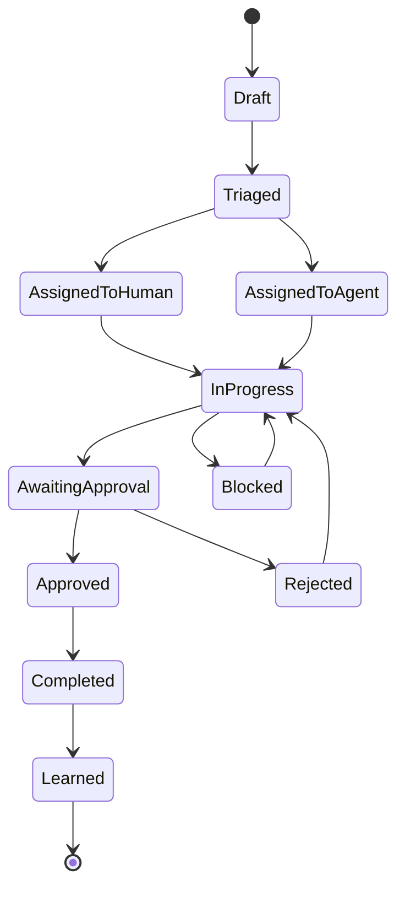
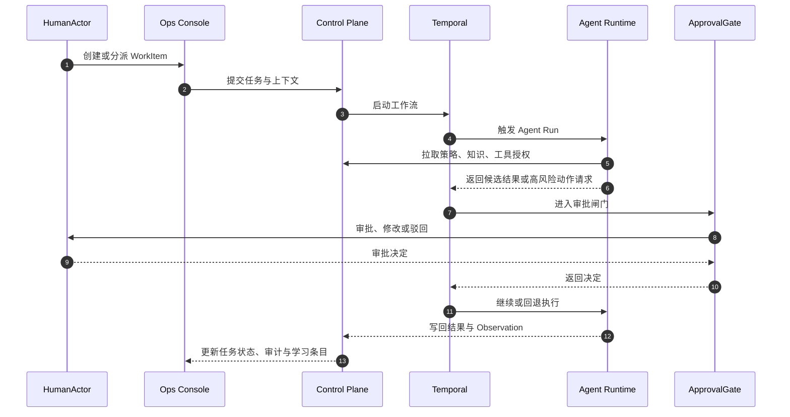

# 人机协作流程

## 设计目标

系统中的每一项工作都必须能回答四个问题：

1. 谁提出目标？
2. 谁实际执行？
3. 谁承担审批责任？
4. 从执行结果中学到了什么？

## WorkItem 生命周期

## 标准协作流

## 典型场景

### 场景 1：智能体辅助招聘筛选

- 人类定义岗位要求和筛选阈值
- AgentActor 对候选人包进行摘要、排序、风险标注
- 高风险判断或拒绝建议必须通过 `ApprovalGate`
- 最终决策与理由被沉淀为 `LearningArtifact`

### 场景 2：入职流程编排

- Temporal 编排跨系统流程
- AgentActor 生成个性化入职包、FAQ 和日程建议
- 人类 HR 审核关键信息后触发发送
- 失败节点走补偿流程并记录审计轨迹

### 场景 3：政策问答与流程建议

- HumanActor 发起问题
- AgentActor 检索知识库并生成结构化答案
- 若触及薪酬、合规、雇佣风险等高风险领域，输出仅作为建议
- 若用户要求执行变更，则必须转入 `WorkItem + ApprovalGate`

## 人工中断点

以下场景默认要求人工中断：

- 访问高敏数据
- 发起外部沟通
- 变更组织/雇佣/薪酬事实
- 修改审批策略、预算或模型路由
- 影响生产策略或发布状态的学习结果落地
