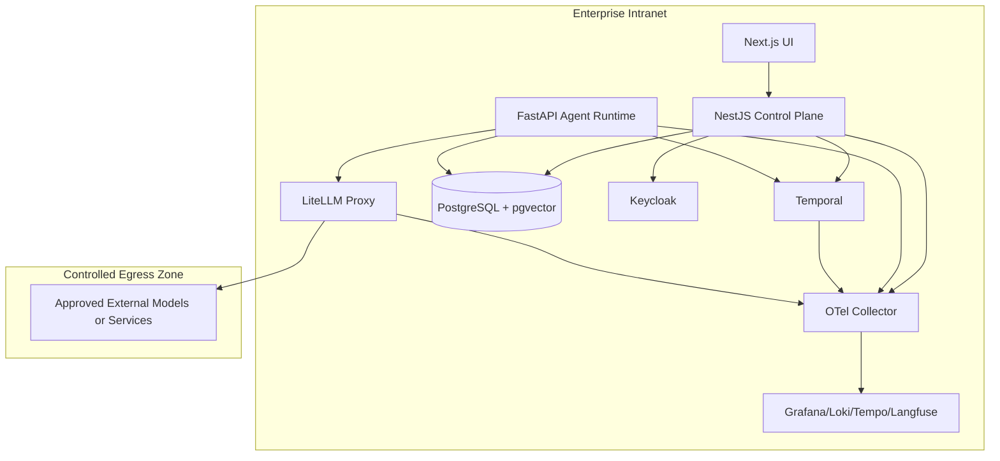

# 部署与运维

## 环境分层

- `dev`：本地开发与文档驱动验证
- `staging`：受控集成、流程回放、评测和灰度预演
- `prod`：生产环境

## 部署拓扑

## 运维重点

### 可观测性

- 全链路 trace：控制面、工作流、agent run、模型调用
- 统一日志：结构化日志进入 Loki
- 指标：业务指标与 LLM 指标同时采集
- Langfuse：观测 prompt、tool 调用、输出和评分

### 备份与恢复

- PostgreSQL 定期全量与增量备份
- Temporal 持久化数据定期演练恢复
- Keycloak realm 与配置备份
- Langfuse/观测关键配置备份

### 发布策略

- 控制面与运行面独立发布
- 学习结果只能灰度发布
- 新模型路由先经过 staging 和限流验证

### 故障处理

- 模型不可用时降级到备用路由或人工接管
- Agent Runtime 故障时由 Temporal 保留流程状态
- 知识检索失败时允许只读退化，但要标记置信度下降

## 未来代码仓建议

- `apps/web`
- `apps/control-plane`
- `apps/agent-runtime`
- `packages/contracts`
- `packages/policy`
- `infra/`

本轮不创建这些目录，只把它们作为后续实现阶段的结构参考。
