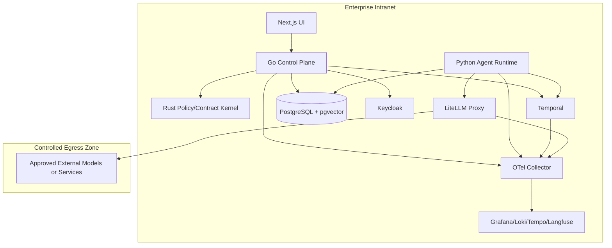

# 部署与运维

## 环境分层

- `dev`：本地开发与文档驱动验证
- `ci`：一次性自动化验证、契约测试、镜像构建和安全扫描
- `staging`：受控集成、流程回放、评测和灰度预演
- `prod`：生产环境

详细隔离规则见 [environment-isolation.md](environment-isolation.md)。后续实现阶段必须补充 `ci` 作为一次性自动化验证环境，不能复用 `dev`、`staging` 或 `prod` 资源。

## 运行档位

环境分层描述发布与隔离边界，运行档位描述不同资源条件下的产品形态。两者不能混用。

| 档位 | 运维目标 | 关键约束 |
| --- | --- | --- |
| `Tiny Mode` | 低配设备、教学和轻量试用 | 文件存储或 SQLite，mock/stub，单用户，低并发 |
| `Demo Mode` | 5 到 10 分钟跑通最小闭环 | 可不启用 Keycloak、Temporal、完整 OTel、Langfuse 和 Grafana |
| `Local Mode` | 个人长期使用 | 本地数据库、基础权限、基础审计、低成本模型路由 |
| `Community Mode` | 多人共用实例 | 多用户、审批流、模板共享、资源配额和可选 FederationLink |
| `Enterprise Mode` | 企业和强治理组织 | 保留 Keycloak、Temporal、PostgreSQL、LiteLLM Proxy、完整观测、环境隔离、备份恢复和灰度发布 |

自适应运行可以降低资源占用，但不能绕过审批、安全、审计、预算、数据分级和环境隔离。

## 部署拓扑

## 运维重点

### 可观测性

- 全链路 trace：控制面、工作流、agent run、模型调用
- 统一日志：结构化日志进入 Loki
- 指标：业务指标与 LLM 指标同时采集
- Langfuse：观测 prompt、tool 调用、输出和评分
- 所有 telemetry 必须带 `env`、`service`、`version`、`workItemId`、`agentRunId`、`actorType` 和 `policyVersion`
- 生产 prompt、tool 输入输出和高敏 trace 的查询必须受权限控制

### 备份与恢复

- PostgreSQL 定期全量与增量备份
- Temporal 持久化数据定期演练恢复
- Keycloak realm 与配置备份
- Langfuse/观测关键配置备份
- 生产恢复演练必须记录 RPO、RTO、恢复版本、验证人和失败项
- 非生产环境不得直接恢复未脱敏生产备份

### 发布策略

- 控制面与运行面独立发布
- 学习结果只能灰度发布
- 新模型路由先经过 ModelCapabilityProfile、EvalRun、staging 和限流验证
- GovernanceBrain 的分派策略、上下文图谱规则和模型路由建议只能作为候选灰度，不能直接覆盖生产规则
- 代码、配置、prompt、workflow、策略和模型路由必须按 `dev` -> `staging` -> `prod` 单向晋级
- 每个生产发布单元必须声明回滚版本、回滚条件和观察窗口

### 发布流程

1. 在 `ci` 完成 lint、类型检查、单元测试、契约测试和镜像扫描。
2. 使用不可变镜像 digest 部署到 `staging`。
3. 在 `staging` 执行迁移演练、流程回放、评测基线和安全检查。
4. 创建发布 WorkItem，附带变更范围、风险、回滚版本和观察指标。
5. 通过 ApprovalGate 后发布到 `prod` 的灰度范围。
6. 观察窗口内检查错误率、延迟、成本、审批漏触发、策略违规和人工修正率。
7. 指标稳定后扩大范围；异常达到阈值时立即回滚。

### 故障处理

- 模型不可用时降级到备用路由或人工接管
- Agent Runtime 故障时由 Temporal 保留流程状态
- 知识检索失败时允许只读退化，但要标记置信度下降
- Temporal worker 故障时暂停新任务分派，保留 workflow 状态并恢复 worker
- PostgreSQL 主库不可用时进入只读或停写模式，避免不完整事实写入
- Keycloak 不可用时禁止新登录和高风险动作，已登录会话按策略降级

## 运行指标

| 指标 | 目标方向 | 异常处理 |
| --- | --- | --- |
| API 错误率 | 越低越好 | 超阈值触发发布暂停或回滚 |
| P95 API 延迟 | 越低越好 | 定位控制面、数据库或依赖瓶颈 |
| AgentRun 成功率 | 越高越好 | 分析工具、模型、策略和数据问题 |
| 审批漏触发率 | 零容忍 | 立即停止相关自动化 |
| 策略违规率 | 零容忍或接近零 | 冻结相关工具或 AgentActor |
| 模型调用成本 | 受预算约束 | 限流、降级或调整模型路由 |
| 模型能力匹配率 | 越高越好 | 检查 ModelCapabilityProfile、EvalRun 和任务切片 |
| 模型间分歧率 | 受场景约束 | 高风险场景升强模型、转人工或补评测样本 |
| GovernanceBrain 分派接受率 | 越高越好 | 检查成员画像、任务切片和分派规则 |
| 人工改派率 | 越低越好 | 检查 TaskFitAssessment 依据、负载和权限边界 |
| Temporal workflow backlog | 稳定可控 | 扩容 worker 或暂停入口 |
| 首次启动时间 | 越低越好 | 检查依赖启动、配置和资源档位 |
| Demo 跑通时间 | 5 到 10 分钟内 | 降低依赖、补充 mock/stub 或修复引导 |
| 低资源降级成功率 | 越高越好 | 检查 AdaptiveRuntimePolicy 和人工接管 |
| 人工接管率 | 受场景约束 | 过高时分析模型、工具、预算或资源瓶颈 |
| 跨实例协作失败率 | 越低越好 | 检查 FederationLink、速率限制、审计和对方实例状态 |

## 运维 Runbook 最低要求

每个关键组件必须有运行手册，至少包含：

- 健康检查方式。
- 常见故障和定位命令。
- 升级、回滚和配置变更步骤。
- 备份与恢复步骤。
- 权限和 secret 轮换步骤。
- 关联 dashboard、日志查询和告警规则。

## 开发环境策略

本项目不要求所有开发者使用同一种宿主机。Windows、Linux、macOS 和 WSL 都应被视为有效开发环境，只要项目级命令保持跨平台。

原则：

- 对 Node、pnpm、uv、Docker CLI 等可跨平台安装的工具，文档应声明版本和安装入口，不把宿主机差异视为产品风险。
- 本地脚本必须优先使用跨平台命令；需要 shell 能力时，优先使用 Node/Python 小脚本封装。
- Docker Compose、devcontainer 或 mock 服务用于封装数据库、Temporal、Keycloak、LiteLLM、对象存储和系统库差异。
- Tiny/Demo/Local Mode 的本地开发路径不应要求开发者先启动完整 Enterprise 依赖。
- README 或 runbook 必须把“本机安装路径”和“容器兜底路径”分开描述。

## 当前代码仓结构

当前 Phase 1 已先落地不连接真实基础设施的环境隔离守卫：

- `packages/contracts`：共享环境、风险、actor、telemetry 和 ToolContract 词表。
- `packages/policy`：环境隔离和 ToolContract 执行边界校验。
- `config/environments`：`dev`、`ci`、`staging`、`prod` 样例配置。

后续服务目录仍按 [developer-experience.md](developer-experience.md) 的目标结构逐步扩展。首批服务目录包括：

- `apps/web`
- `apps/control-plane`
- `apps/agent-runtime`
- `packages/evals`
- `packages/federation`
- `packages/devtools`
- `infra/`
- `scripts/`
- `docs/zh-CN/runbooks/`
