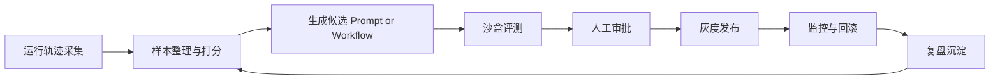

# 学习与自进化飞轮

## 原则

AI HRMS 允许系统学习，但不允许系统未经约束地自我改写生产行为。v1 的自我进化范围仅限于：

- 提示词优化候选
- 工作流分支优化候选
- 工具选择策略候选
- 知识摘要与记忆组织候选
- 人机协作模板候选

## 受控飞轮

## 阶段说明

### 1. 运行轨迹采集

- 收集 `Observation`
- 收集用户反馈、审批结果、失败案例
- 收集 token、延迟、工具调用和预算消耗

### 2. 样本整理与打分

- 形成数据集切片
- 标记成功、失败、拒绝、升级和人工修正样本
- 为候选变更指定业务指标和质量指标

### 3. 生成候选

- 生成新的 prompt、graph 分支或策略参数
- 给出变更假设和预期收益
- 绑定风险等级和适用范围

### 4. 沙盒评测

- 通过固定样本集进行回放
- 检查任务成功率、工具合规率、审批触发率、成本和延迟
- 对比基线版本

### 5. 人工审批

- 查看评测结果、差异说明和风险标签
- 决定批准、拒绝、修改后批准或升级审查

### 6. 灰度发布

- 控制目标人群、部门或工作流百分比
- 持续观察指标和异常

### 7. 回滚与复盘

- 达到阈值立即回滚
- 将问题样本沉淀到数据集
- 更新策略规则或评测覆盖

## v1 明确禁止

- 智能体直接修改生产代码并自动上线
- 智能体绕过审批变更预算、策略或权限
- 仅凭单次成功样本就替换生产策略

## 评测核心指标

- 任务完成率
- 人工修正率
- 审批命中率
- 策略违规率
- 平均成本
- P95 延迟
- 回滚频次
