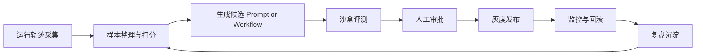

# 学习与自进化飞轮

## 原则

AI-HRMS 允许系统学习，但不允许系统未经约束地自我改写生产行为。v1 的自我进化范围仅限于：

- 提示词优化候选
- 工作流分支优化候选
- 工具选择策略候选
- 知识摘要与记忆组织候选
- 人机协作模板候选
- Workflow Template、Skill Recipe、ToolContract 的改进候选
- GovernanceBrain 生成的文档一致性、任务分派、模型路由和协作协调改进候选
- Failure case、Review note 和脱敏 SharedEvalSummary 的沉淀
- 脱敏后的训练、评测或模型能力改进资源
- TeachingMaterial、LearningPath、TeachingStrategy、CapabilityProof 的改进候选

原始敏感数据不得直接作为训练资源保留。敏感数据只有经过脱敏、审批、审计、用途限定、保留期约束和重识别风险评估后，才能形成 `DesensitizedTrainingResource`。

MVP 阶段学习飞轮不依赖完整教学引擎。它只要求文档教材、首个模板、失败复盘和报告卡能形成可改进的学习材料。

## 受控飞轮

## 阶段说明

### 1. 运行轨迹采集

- 收集 `Observation`
- 收集用户反馈、审批结果、失败案例
- 收集 token、延迟、工具调用和预算消耗
- 收集策略判断、审批命中、人工修改差异和回滚事件
- 收集样本时必须保留环境标签、数据分级和来源引用
- 收集 ProjectInstance、运行档位、资源降级、人工接管和 ExecutionReportCard 引用
- 收集 TaskFitAssessment、ModelCapabilityProfile、模型路由选择、模型间分歧和人工分派修正引用
- 收集 TeachingMaterial 反馈、首个模板跑通结果和 CapabilityProof 来源引用

### 2. 样本整理与打分

- 形成数据集切片
- 标记成功、失败、拒绝、升级和人工修正样本
- 为候选变更指定业务指标和质量指标
- 删除或脱敏不必要的个人敏感信息
- 将样本绑定到固定数据集版本，避免评测漂移
- 公开或跨实例共享时只能生成 SharedEvalSummary，不得共享原始上下文、内部任务或敏感字段
- 需要长期保留为训练资源的样本必须记录脱敏方法、残余重识别风险、允许用途、保留期和撤回策略

### 3. 生成候选

- 生成新的 prompt、graph 分支或策略参数
- 生成任务分派规则、模型路由规则或项目上下文图谱修正候选
- 生成 TeachingMaterial、LearningPath、TeachingStrategy 或 CapabilityProof 展示方式的改进候选
- 给出变更假设和预期收益
- 绑定风险等级和适用范围
- 声明候选变更的 owner、影响范围、回滚方式和不适用场景
- 不允许候选变更直接覆盖生产配置

### 4. 沙盒评测

- 通过固定样本集进行回放
- 检查任务成功率、工具合规率、审批触发率、成本和延迟
- 检查分派接受率、人工改派率、模型能力匹配率、结构化输出合规率和模型间分歧率
- 对比基线版本
- 输出按样本切片拆分的差异报告
- 对高风险样本进行人工复核或规则复核

### 5. 人工审批

- 查看评测结果、差异说明和风险标签
- 决定批准、拒绝、修改后批准或升级审查
- 审批必须引用评测运行、候选版本、风险等级和回滚方案

### 6. 灰度发布

- 控制目标人群、部门或工作流百分比
- 持续观察指标和异常
- 灰度范围必须可收缩，且不能跳过 staging
- 每次扩大灰度前必须检查治理指标和成本指标

### 7. 回滚与复盘

- 达到阈值立即回滚
- 将问题样本沉淀到数据集
- 更新策略规则或评测覆盖
- 复盘必须记录根因、漏测样本类型和后续防护规则

## LearningArtifact 元数据

每个学习沉淀物至少包含：

- `artifactId`
- `artifactType`：`prompt`、`workflow_branch`、`tool_policy`、`knowledge_summary`、`collaboration_template`、`teaching_material`、`learning_path`、`capability_proof`
- `artifactSubtype`：可选记录 `task_assignment_policy`、`model_route_policy`、`context_graph_fix`、`mvp_tutorial`、`first_template` 等细分类型
- `sourceRefs`：WorkItem、AgentRun、Observation、审批或评测引用
- `projectInstanceId`
- `dataClassification`
- `owner`
- `createdAt`
- `applicableScopes`
- `riskLevel`
- `baselineVersion`
- `candidateVersion`
- `rollbackRef`
- `shareScope`：`private`、`instance`、`commons_candidate`、`public`

没有来源引用、数据等级或适用范围的 LearningArtifact 不能进入评测。

## 脱敏训练资源

从 `Observation`、失败样本、人工修正或审批结果中生成训练资源时，必须遵守 [data-lifecycle-and-training-resources.md](data-lifecycle-and-training-resources.md)。

训练资源至少要绑定：

- 原始来源引用。
- 原始数据分级和当前数据分级。
- 脱敏方法和版本。
- 残余重识别风险。
- 允许用途和禁止用途。
- owner、审批引用和审计事件。
- 保留期和撤回策略。

训练资源可以用于离线评测、评分器校准、失败模式分类、`ModelCapabilityProfile` 评测、模板质量改进或经审批的模型训练。训练资源不得用于还原个人身份、自动生成个人绩效结论、绕过原始数据权限或默认公开分享。

## Experiment 生命周期

| 状态 | 含义 | 退出条件 |
| --- | --- | --- |
| `draft` | 候选变更和假设尚未完整 | 补齐 owner、指标、样本和风险 |
| `ready` | 可运行评测 | 固定数据集和评分器版本 |
| `running` | 正在离线评测或流程回放 | 产生评测结果 |
| `reviewing` | 等待人工审查 | 审批决定 |
| `approved` | 可进入灰度 | 发布计划和回滚方案确认 |
| `rejected` | 候选被拒绝 | 记录原因并沉淀样本 |
| `rolled_back` | 灰度或生产回滚 | 复盘完成 |

## v1 明确禁止

- 智能体直接修改生产代码并自动上线
- 智能体绕过审批变更预算、策略或权限
- 仅凭单次成功样本就替换生产策略
- GovernanceBrain 直接把自我迭代候选落地为生产分派、生产模型路由或生产权限变更
- CapabilityDiscovery 或 CapabilityProof 被用于自动绩效、排名、处罚或强制分派
- KeywordHelpOverlay、自适应教学或复杂能力发现成为 MVP 跑通前置条件

## 评测核心指标

- 任务完成率
- 人工修正率
- 审批命中率
- 策略违规率
- 平均成本
- P95 延迟
- 回滚频次
- 任务分派接受率
- 人工改派率
- 模型能力匹配率
- 模型间分歧率
- 文档教学跑通率
- 首个模板跑通时间
- CapabilityProof 单一分数违规率

## 发布门槛

- 治理指标不得劣化，尤其是审批漏触发率和策略违规率。
- 高风险流程必须达到审批漏触发零容忍目标。
- 成本或延迟增加必须有业务指标收益支撑，并经审批确认。
- 人工修正率上升必须阻断生产发布，除非审批人明确接受该风险。
- 任何影响 `prod` 的学习结果都必须遵守 [environment-isolation.md](environment-isolation.md) 的晋级路径。
